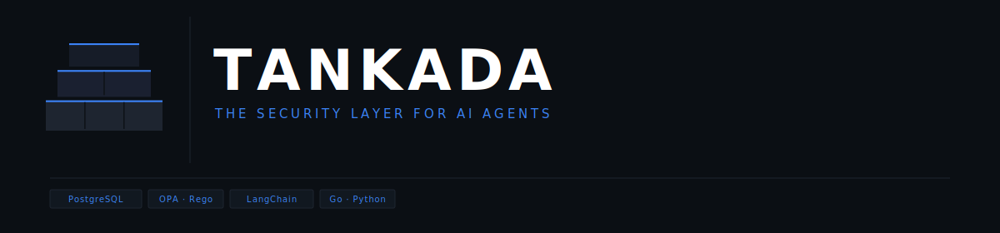

**A proxy that sits between your AI agents and your database and decides whether each query is allowed to run.**

---

## The problem

AI agents generate SQL autonomously. They don't know your data boundaries, and they can be manipulated into running queries that look syntactically fine but are dangerous. An agent asked to "show all users" might generate:

```sql
SELECT * FROM users WHERE 1=1   -- tautology, filters nothing
SELECT table_name FROM information_schema.tables  -- schema recon
SELECT email, password FROM users WHERE id > 0 UNION SELECT ...  -- extraction
```

Traditional proxies block `DROP TABLE`. They don't catch any of these.

---

## How it works

Every query goes through four steps before touching the database:

1. **Parse** — sqlglot builds an AST. No regex. Structural analysis of what the query actually does.
2. **Evaluate** — OPA checks the AST against your Rego policies. Rules reload without restart.
3. **Execute or block** — allowed queries run; blocked ones get a structured JSON reason the agent can read and act on.
4. **Log** — every request is written to an audit trail with risk score, agent identity, and the original query text.

---

## Why AST, not regex

String matching works for `DROP TABLE`. It breaks as soon as the query gets slightly creative.

These all pass regex-based tools. Tankada blocks them:

```sql
-- column renamed to dodge keyword matching
SELECT password AS p FROM users WHERE id = 1

-- WHERE is present but filters nothing
SELECT * FROM users WHERE user_id = user_id

-- second statement hidden after semicolon
SELECT id, name FROM products; DROP TABLE sessions--

-- structurally identical to 1=1
SELECT email FROM users WHERE active = active
```

Tankada uses [sqlglot](https://github.com/tobymao/sqlglot) to parse every query into an AST before evaluating it. A tautology is a tautology whether it's `1=1`, `'a'='a'`, or `user_id = user_id`. An alias bypass is caught whether the column is renamed to `p`, `x`, or `data`.

---

## Architecture

```
AI Agent (LangChain, LlamaIndex, AutoGen, custom)
    |
    | POST /v1/query  {"query": "SELECT ...", "context": {...}}
    | Authorization: Bearer <JWT>
    v
┌─────────────────────────────────────────────────────┐
│                    Gateway :8080                    │
│  JWT auth → Analyzer → OPA → Proxy → Audit log      │
└──────┬──────────────┬──────────────┬────────────────┘
       │              │              │
       v              v              v
  Analyzer       OPA :8181      Proxy :8082
   :8001        (Rego policy)   (SET ROLE tankada_app
  (sqlglot         allow/deny    + write block)
   AST)          + risk score        │
                                     v
                            PostgreSQL :5432
                         (Row Level Security:
                          tenant_id enforced
                          at DB layer — wall 3)
```

Three independent enforcement walls:
1. **OPA** — semantic policy engine, blocks at the query analysis layer
2. **Proxy** — unconditionally rejects write operations at the application layer
3. **PostgreSQL RLS** — enforces tenant isolation at the DB layer via `tankada_app` role and `SET LOCAL` session variables; returns zero rows even if both layers above are bypassed

---

## Detection capabilities

| Pattern | How detected | Default action |
|---|---|---|
| Tautology WHERE (1=1, OR 1=1, col=col) | AST node analysis | Deny |
| Schema enumeration (information_schema, pg_catalog, pg_*) | Table/schema name match | Hard deny |
| PII column access (email, password, ssn, iban, credit_card...) | Column name keyword match (40 keywords) | Deny without scope |
| Cross-tenant access (query touches a tenant-scoped table without `tenant_id = <agent's JWT tenant>` filter) | Top-level AND equality extraction + JWT comparison | Hard deny |
| Cross-tenant access at DB layer (even if policy is bypassed) | PostgreSQL RLS — `tankada_app` role + `SET LOCAL app.tenant_id` per transaction | Zero rows returned |
| SELECT without WHERE | `has_where = false` | Deny |
| SELECT * without LIMIT | Star column + no limit | Risk +2 |
| High LIMIT (> 500) | Literal value extraction | Risk +2 |
| UNION / INTERSECT / EXCEPT | AST union node | Risk +2 |
| SQL comments (-- or /* */) | Raw SQL scan before parse | Risk +1 |
| ORDER BY RANDOM() | AST rand node | Risk +1 |
| Multi-statement injection (`SELECT ...; DROP ...`) | Statement count after parse | Hard deny |
| Destructive operations (DELETE, DROP, TRUNCATE, ALTER) | Query type | Hard deny |
| Invalid/malformed SQL | Unrecognized AST node type | Hard deny (fail closed) |

Risk score >= 7 triggers automatic deny. Threshold is configurable in `policies/query.rego`.

---

## Quick start

Requires Docker and Docker Compose.

```bash
git clone https://github.com/saluc28/tankada.git
cd tankada/deploy

docker compose up -d
```

Services:
- Gateway: http://localhost:8080
- Analyzer: http://localhost:8001
- OPA: http://localhost:8181
- PostgreSQL: localhost:5432

**Run the demo dashboard:**

```bash
cd sdk/python/dashboard
pip install langgraph pyjwt

# Ollama (default - local, no API key needed)
pip install langchain-ollama
# requires Ollama running with: ollama pull qwen2.5:7b
python server.py

# OpenAI
pip install langchain-openai
LLM_PROVIDER=openai LLM_API_KEY=sk-... python server.py

# Anthropic
pip install langchain-anthropic
LLM_PROVIDER=anthropic LLM_API_KEY=sk-ant-... python server.py
```

Open http://localhost:8090. Override the model with `LLM_MODEL=gpt-4o` etc.

**Generate a JWT token:**

```bash
pip install pyjwt

python - <<'EOF'
import jwt, datetime
token = jwt.encode({
    "agent_id":  "my-agent",
    "tenant_id": "tenant_1",
    "roles":         ["analyst"],
    "scopes":        ["orders:read"],
    "exp": datetime.datetime.utcnow() + datetime.timedelta(hours=2)
}, "dev-secret-change-in-production", algorithm="HS256")
print(token)
EOF
```

**Send a query:**

```bash
TOKEN="<paste token here>"

# products has no tenant_id column, no tenant filter needed
curl -s -X POST http://localhost:8080/v1/query \
  -H "Authorization: Bearer $TOKEN" \
  -H "Content-Type: application/json" \
  -d '{"query": "SELECT id, name, price FROM products WHERE category = '\''hardware'\''"}' \
  | jq

# orders and users have a tenant_id column, the filter is required
curl -s -X POST http://localhost:8080/v1/query \
  -H "Authorization: Bearer $TOKEN" \
  -H "Content-Type: application/json" \
  -d '{"query": "SELECT id, product, amount FROM orders WHERE tenant_id = '\''tenant_1'\'' AND status = '\''completed'\''"}' \
  | jq
```

> The seed database (`deploy/postgres/init.sql`) contains rows for `tenant_1` and `tenant_2`. Use `tenant_1` in your JWT and queries to get results from the demo data.

**Response:**
```json
{
  "event_id": "a3f2...",
  "decision": "allow",
  "risk_score": 0,
  "risk_level": "low",
  "result": {
    "columns": ["id", "name", "price"],
    "rows": [[1, "Widget Pro", 99.99]],
    "row_count": 1
  },
  "latency_ms": 12
}
```

---

## Policy configuration

Policies are in `policies/query.rego`. OPA hot-reloads them — no restart needed.

**Add a sensitive table:**
```rego
sensitive_tables = {
    "users", "payments", "credentials", "secrets", "pii_data", "audit_logs",
    "salaries"   # <- add your tables here
}
```

**Block a query type:**
```rego
deny[reason] {
    input.analysis.query_type == "UPDATE"
    reason := "UPDATE operations are not allowed for AI agents"
}
```

**Lower the risk threshold:**
```rego
deny[reason] {
    risk_score >= 5   # was 7
    reason := sprintf("risk score %v exceeds threshold (5)", [risk_score])
}
```

**Allow PII access for specific scopes:**
The default policy allows PII column access if the agent JWT contains `roles: ["admin"]` or `scopes: ["users:read"]`. Extend `agent_has_scope` in `query.rego` to add your own scopes.

**Mark a table as tenant-global (no `tenant_id` column):**
By default, every SELECT on a table must include `tenant_id = <agent's JWT tenant>` as a top-level AND filter. Tables without a `tenant_id` column (lookup tables, shared catalogs) must be listed explicitly:
```rego
tenant_global_tables = {"products", "categories", "currency_rates"}
```

---

## JWT token structure

Every request needs a signed JWT in `Authorization: Bearer`.

```json
{
  "agent_id":      "my-agent-001",
  "owner_user_id": "alice",
  "tenant_id":     "tenant_1",
  "roles":         ["analyst"],
  "scopes":        ["orders:read", "products:read"],
  "exp":           1234567890
}
```

Set `JWT_SECRET` in env. The default (`dev-secret-change-in-production`) is intentionally useless in production — the gateway logs a warning if it's not overridden.

---

## API reference

### `POST /v1/query`

**Headers:** `Authorization: Bearer <token>`, `Content-Type: application/json`

**Body:**
```json
{
  "query": "SELECT id, name FROM products WHERE id = 1",
  "context": {
    "task_description":  "optional human-readable task",
    "user_id":           "optional end-user id"
  }
}
```

**Response (allow):** HTTP 200
```json
{
  "event_id":   "uuid",
  "decision":   "allow",
  "risk_score": 0,
  "risk_level": "low",
  "result":     {"columns": [...], "rows": [...], "row_count": 1},
  "latency_ms": 12
}
```

**Response (deny by policy):** HTTP 403
```json
{
  "event_id":   "uuid",
  "decision":   "deny",
  "reasons":    ["WHERE clause is a tautology (e.g. 1=1)"],
  "risk_score": 2,
  "risk_level": "low",
  "latency_ms": 8
}
```

**Response (fail-closed, analyzer or OPA unreachable):** HTTP 503
```json
{
  "event_id":   "uuid",
  "decision":   "deny",
  "reasons":    ["analyzer unavailable: failing closed"],
  "risk_score": 10,
  "risk_level": "high",
  "latency_ms": 5002
}
```
Fail-closed denies are also recorded in the audit log with `query_type: "FAIL_CLOSED"` so operators can distinguish infrastructure outages from policy denials.

**Response (rate limit exceeded):** HTTP 429

### `POST /analyze` (Analyzer - port 8001)

Test SQL analysis directly without going through the gateway:

```bash
curl -s -X POST http://localhost:8001/analyze \
  -H "Content-Type: application/json" \
  -d '{"query": "SELECT email FROM users WHERE 1=1"}'
```

---

## Observability

Every request is logged as structured JSON to stdout. Pipe it to whatever log stack you use, or run the included dashboard (`sdk/python/dashboard/`) for a live view.

Each event includes:
```json
{
  "event_id":        "uuid",
  "agent_id":        "my-agent",
  "tenant_id":       "acme-corp",
  "query_original":  "SELECT ...",
  "query_type":      "SELECT",
  "tables_accessed": ["products"],
  "policy_decision": "allow",
  "risk_score":      0,
  "risk_level":      "low",
  "latency_ms":      12,
  "timestamp":       "2026-04-28T..."
}
```

---

## Tests

```bash
cd analyzer
pip install pytest sqlglot pydantic
pytest test_analyzer.py -v
# 63 passed in 0.32s
```

---

## Environment variables

| Variable | Default | Description |
|---|---|---|
| `JWT_SECRET` | `dev-secret-change-in-production` _(gateway logs a warning if unset)_ | HMAC secret for JWT validation. **Must be set in production.** |
| `PORT` | `8080` | Gateway listen port |
| `ANALYZER_URL` | `http://analyzer:8001` | Analyzer service URL |
| `OPA_URL` | `http://opa:8181` | OPA service URL |
| `PROXY_URL` | `http://proxy:8082` | Proxy service URL |
| `DATABASE_URL` | `postgres://...` | PostgreSQL connection string (proxy) |
| `RATE_LIMIT_QPM` | `60` | Max queries per minute per agent (0 = disabled) |

---

## License

MIT — see [LICENSE](LICENSE)

---

## Contributing

Issues and PRs welcome. Things that would be useful:
- MySQL, SQLite, MSSQL dialect support (sqlglot handles parsing, the gaps are in detection rules)
- New detection patterns — especially LLM-specific attack vectors that aren't covered yet
- Integration examples with LangChain, LlamaIndex, AutoGen
